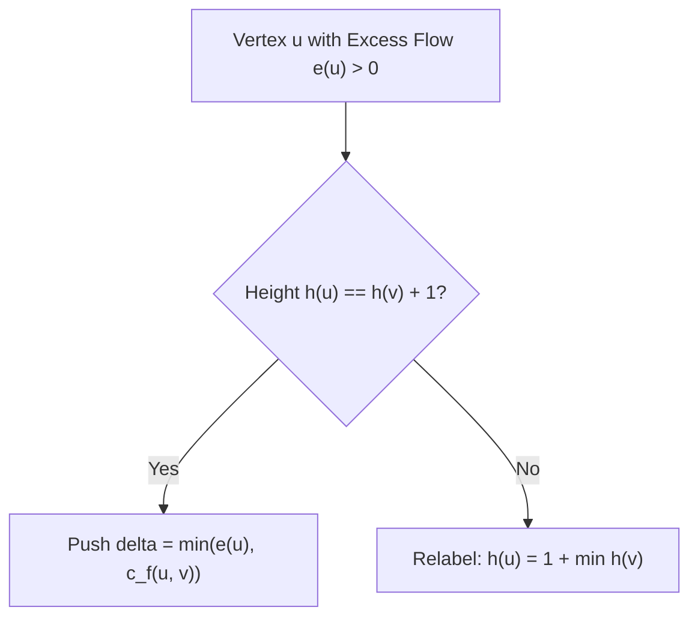

# Push-Relabel Max Flow Algorithm Skill

Robust, zero-dependency Python implementation of the **Goldberg-Tarjan Push-Relabel Algorithm** for asymptotic \(O(V^3)\) maximum flow computation.

## Features
- **Preflow-Push Dynamics**: Operates locally by pushing excess flow across downhill residual edges.
- **Height Function Relabeling**: Maintains valid labeling bounds ensuring no augmenting path exists when excess dissipates.
- **Zero External Dependencies**: Pure Python standard library.
- **Native MCP Protocol**: JSON-RPC 2.0 stdio server compatible with Claude Desktop, Cursor, and Windsurf.

## Architecture

